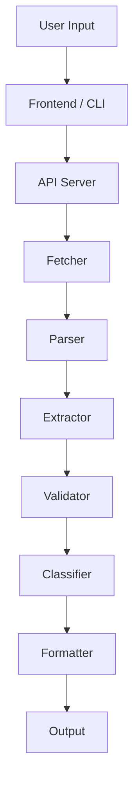
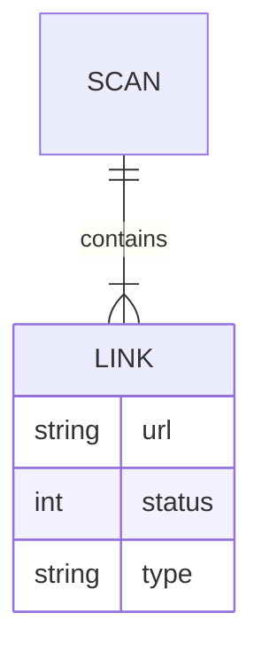

# Broken Link Checker

<p align="center">
<svg width="100%" height="140" viewBox="0 0 900 140" xmlns="http://www.w3.org/2000/svg">
  <defs>
    <linearGradient id="grad">
      <stop offset="0%" stop-color="#0ea5e9">
        <animate attributeName="stop-color" values="#0ea5e9;#6366f1;#0ea5e9" dur="6s" repeatCount="indefinite"/>
      </stop>
      <stop offset="100%" stop-color="#6366f1">
        <animate attributeName="stop-color" values="#6366f1;#0ea5e9;#6366f1" dur="6s" repeatCount="indefinite"/>
      </stop>
    </linearGradient>
  </defs>

  <rect width="900" height="140" fill="#020617"/>

<text x="50%" y="45%" text-anchor="middle"
     font-size="32" fill="url(#grad)" font-family="monospace">
Broken Link Checker </text>

<text x="50%" y="75%" text-anchor="middle"
     font-size="14" fill="#94a3b8" font-family="monospace">
Scan • Detect • Fix Broken Links Efficiently </text> </svg>

</p>

<p align="center">
  <b>Scan websites. Detect broken links. Improve reliability, UX, and SEO.</b>
</p>

---

## 📌 Overview

Broken Link Checker is a full-stack tool that scans websites and detects:

* Broken links (HTTP 4xx / 5xx)
* Redirect links (3xx)
* Working links (2xx)
* Broken images

Supports:

* Web interface
* CLI usage

---

## ⚠️ Problem

Websites often suffer from:

* Dead links
* Broken images
* Outdated references

This leads to:

* Poor user experience
* SEO penalties
* Reduced trust

---

## 💡 Solution

This tool automates:

* Crawling web pages
* Extracting links and images
* Validating HTTP responses
* Generating structured reports

---

## ⚡ Features

* Parallel request processing
* Retry mechanism
* Multi-page crawling
* Broken image detection
* CLI + Web interface
* JSON export
* Filtering (internal/external)
* Response time tracking

---

## 🛠 Tech Stack

**Backend**

* Node.js
* Express.js
* Axios
* Cheerio

**Frontend**

* HTML
* CSS
* Vanilla JavaScript

**CLI**

* Commander.js
* Chalk

---

## 🚀 Installation

```bash id="inst1"
git clone https://github.com/your-username/broken-link-checker.git
cd broken-link-checker
npm install
```

---

## ▶️ Run Application

```bash id="run1"
node index.js
```

Open in browser:

```text id="url1"
http://localhost:5000
```

---

## 💻 CLI Usage

```bash id="cli1"
blc --url https://example.com
```

### Options

```text id="cliopt"
-u, --url <url>       Target URL
--internal            Only internal links
--external            Only external links
--json                Output JSON
--summary             Summary only
--deep                Deep scan
```

---

## 🔗 API

### Endpoint

```text id="api1"
POST /scan
```

### Request

```json id="req1"
{
  "url": "https://example.com"
}
```

### Response

```json id="res1"
{
  "total": 10,
  "working": 7,
  "broken": 2,
  "redirect": 1
}
```

---

## 📁 Project Structure

```text id="struct1"
broken-link-checker/
├── bin/
├── src/
│   ├── crawler.js
│   ├── utils.js
│   ├── formatter.js
├── public/
├── index.js
├── package.json
```

---

## 🧠 How It Works

1. Fetch HTML
2. Parse DOM
3. Extract links
4. Normalize URLs
5. Send HTTP requests
6. Classify results
7. Generate report

---

## 🧩 System Architecture



---

## 🗄 ER Diagram



---

## 🔐 Performance & Safety

* Rate limiting
* Timeout handling
* Retry logic
* Max link threshold

---

## 📈 Future Improvements

* PDF reports
* Chrome extension
* AI analysis
* CI/CD integration

---

## 📄 License

MIT © 2026 Chhatrapati Sahu

---

<p align="center">
  Built for modern web reliability
</p>
