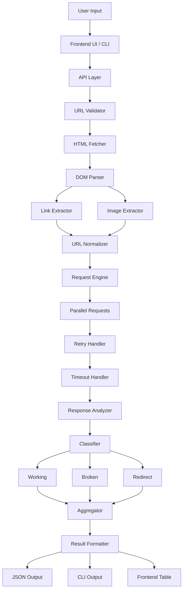
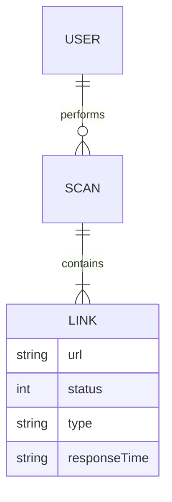

# Broken Link Checker

<p align="center">

<!-- Custom Animated Banner (PURE SVG) -->

<svg width="100%" height="120" viewBox="0 0 800 120" xmlns="http://www.w3.org/2000/svg">
  <rect width="800" height="120" fill="#0f172a"/>

<text x="50%" y="50%" dominant-baseline="middle" text-anchor="middle"
     font-size="28" fill="#38bdf8" font-family="monospace">
Broken Link Checker <animate attributeName="opacity" values="0;1;0" dur="3s" repeatCount="indefinite"/> </text>

<text x="50%" y="80%" dominant-baseline="middle" text-anchor="middle"
     font-size="14" fill="#94a3b8" font-family="monospace">
Scan • Detect • Fix </text> </svg>

</p>

---

## <!-- Inline SVG Icon -->

<svg width="20" height="20" fill="none" stroke="currentColor" stroke-width="2"><circle cx="10" cy="10" r="8"/></svg> About

Broken Link Checker is a full-stack tool that scans websites and detects:

* Broken links (HTTP 4xx / 5xx)
* Redirect links (3xx)
* Working links (2xx)
* Broken images

Supports:

* Web interface
* CLI usage

---

## <svg width="20" height="20" stroke="currentColor" fill="none" stroke-width="2"><path d="M5 12l5-5 5 5"/></svg> Features

* Link extraction using DOM parsing
* Parallel HTTP validation
* Retry mechanism for reliability
* Multi-page crawling (depth-based)
* Image validation support
* CLI + Web dual interface
* JSON export
* Filtering (internal / external)

---

## <svg width="20" height="20" stroke="currentColor" fill="none" stroke-width="2"><rect x="3" y="3" width="14" height="14"/></svg> Tech Stack

* Node.js
* Express.js
* Axios
* Cheerio
* Vanilla JavaScript

---

## <svg width="20" height="20" stroke="currentColor" fill="none" stroke-width="2"><path d="M4 4h12v12H4z"/></svg> Installation

```bash
git clone https://github.com/your-username/broken-link-checker.git
cd broken-link-checker
npm install
```

---

## <svg width="20" height="20" stroke="currentColor" fill="none" stroke-width="2"><polygon points="5,3 19,12 5,21"/></svg> Run

```bash
node index.js
```

---

## <svg width="20" height="20" stroke="currentColor" fill="none" stroke-width="2"><path d="M3 12h18"/></svg> CLI Usage

```bash
blc --url https://example.com
```

---

## <svg width="20" height="20" stroke="currentColor" fill="none" stroke-width="2"><path d="M12 2v20M2 12h20"/></svg> API

POST `/scan`

```json
{
  "url": "https://example.com",
  "deepScan": true
}
```

---

## <svg width="20" height="20" stroke="currentColor" fill="none" stroke-width="2"><path d="M3 3h18v18H3z"/></svg> Advanced System Architecture



---

## <svg width="20" height="20" stroke="currentColor" fill="none" stroke-width="2"><circle cx="10" cy="10" r="8"/></svg> ER Diagram



---

## <svg width="20" height="20" stroke="currentColor" fill="none" stroke-width="2"><path d="M5 12h14"/></svg> Performance

* Rate limiting
* Timeout control
* Retry mechanism
* Max link threshold

---

## <svg width="20" height="20" stroke="currentColor" fill="none" stroke-width="2"><path d="M12 2l3 7h7l-5 5 2 7-7-4-7 4 2-7-5-5h7z"/></svg> Future Improvements

* PDF reports
* Chrome extension
* AI error explanation
* CI/CD integration

---

## <svg width="20" height="20" stroke="currentColor" fill="none" stroke-width="2"><path d="M3 3h18v18H3z"/></svg> License

MIT © 2026 Chhatrapati Sahu
