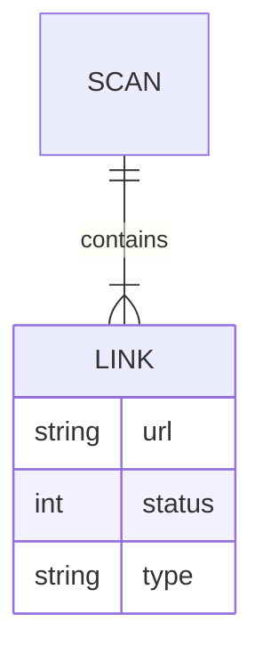

# Broken Link Checker

<p align="center">
  
</p>

<p align="center">
  
  
  
  
  
</p>

---

## Overview

A full-stack tool to scan websites and detect:

- Broken links  
- Redirects  
- Working resources  

This helps improve user experience and SEO performance.

---

## Features

- Scan websites for broken links  
- Detect redirects and working links  
- Internal and external link filtering  
- Deep scan (multi-page crawling)  
- CLI and Web interface  
- JSON report output  

---

## Tech Stack

### Backend
<p>
  
</p>

- Node.js  
- Express.js  
- Axios  
- Cheerio  

---

### Frontend
<p>
  
</p>

- HTML  
- CSS  
- JavaScript  

---

### CLI
<p>
  
</p>

- Commander.js  
- Chalk  

---

## Setup and Usage

### 1. Clone the repository

```bash
git clone https://github.com/your-username/broken-link-checker.git
cd broken-link-checker
```

### 2. Install dependencies

```bash
npm install
```

### 3. Run the application

```bash
node index.js
```

### 4. Open in browser

```
http://localhost:5000
```

---

## API Example

### POST `/scan`

#### Request

```json
{
  "url": "https://example.com",
  "onlyInternal": false,
  "onlyExternal": false,
  "deepScan": false
}
```

#### Response

```json
{
  "total": 10,
  "working": 7,
  "broken": 2,
  "redirect": 1,
  "results": [
    {
      "url": "https://example.com/about",
      "status": 200,
      "type": "WORKING"
    }
  ]
}
```

---

## CLI Usage

```bash
blc --url https://example.com
```

---

## Project Structure

```text
broken-link-checker/
├── bin/
├── src/
├── public/
├── index.js
└── package.json
```

---

## Architecture



---

## Performance and Safety

- Rate limiting  
- Timeout handling  
- Retry mechanism  
- Max link limit  

---

## License

MIT

---

## Author

Chhatrapati Sahu  
https://github.com/Chhatrapati-sahu-09

---

## Support

If you find this project useful, consider starring and sharing it.
