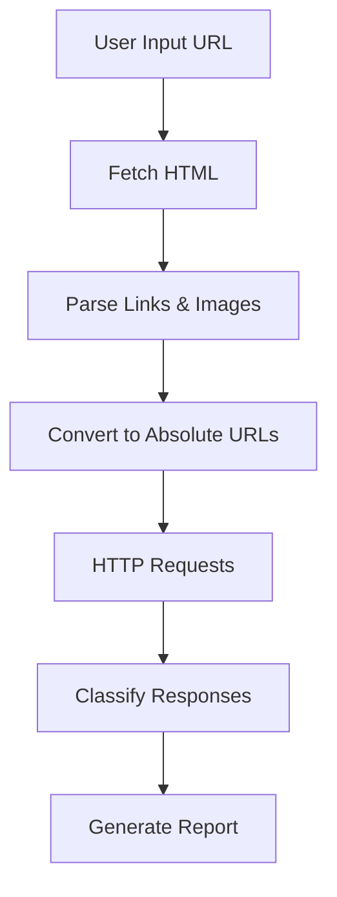
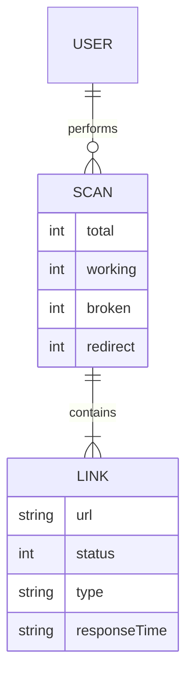

# Broken Link Checker

<p align="center">
  <a href="https://github.com/Chhatrapati-sahu-09">
    
  </a>
</p>

<p align="center">
  <b>Scan websites. Detect broken links. Improve reliability, UX, and SEO.</b>
</p>

---

##  About the Project

Broken Link Checker is a full-stack developer utility that scans websites and validates all hyperlinks and media resources.

It identifies:

* Broken links (HTTP 4xx / 5xx)
* Redirect chains (3xx)
* Working links (2xx)
* Broken images

The tool is designed for:

* Developers
* QA engineers
* SEO analysts

It is available as:

* Web Interface (browser-based)
* CLI Tool (developer workflow)

---

##  Problem Statement

Modern websites often contain:

* Dead links (404)
* Outdated resources
* Broken media

These issues lead to:

* Poor user experience
* SEO penalties
* Reduced trust

Manual detection is inefficient.

---

##  Solution

This tool automates:

* Crawling web pages
* Extracting all links and images
* Validating each resource
* Generating a structured report

Result:

* Fast detection
* Actionable insights
* Improved website quality

---

##  Key Features

| Feature           | Description                |
| ----------------- | -------------------------- |
| Link Extraction   | Parses all anchor tags     |
| HTTP Validation   | Checks response status     |
| Parallel Requests | Faster scanning            |
| Retry Mechanism   | Handles temporary failures |
| Deep Crawling     | Multi-page scanning        |
| Image Validation  | Detects broken images      |
| Filtering         | Internal / external links  |
| CLI Support       | Terminal usage             |
| Export            | JSON report                |
| Stats Dashboard   | Summary analytics          |

---

##  Tech Stack

<p align="center">
  
  
  
  
  
</p>

### Backend

* Node.js
* Express.js
* Axios
* Cheerio

### Frontend

* HTML
* CSS
* Vanilla JavaScript

### CLI

* Commander.js
* Chalk

---

##  Installation

### Clone Repository

```bash
git clone https://github.com/your-username/broken-link-checker.git
cd broken-link-checker
```

### Install Dependencies

```bash
npm install
```

---

##  Running the Project

### Start Backend Server

```bash
node index.js
```

Open:

```
http://localhost:5000
```

---

##  CLI Usage

### Setup CLI

```bash
npm link
```

### Run Command

```bash
blc --url https://example.com
```

### Options

```
-u, --url <url>       Target website
--internal            Scan internal links only
--external            Scan external links only
--json                Output JSON format
--summary             Show summary only
--deep                Enable multi-page scan
```

---

##  API Usage

### Endpoint

```
POST /scan
```

### Request Body

```json
{
  "url": "https://example.com",
  "deepScan": true
}
```

### Response

```json
{
  "total": 20,
  "working": 15,
  "broken": 3,
  "redirect": 2,
  "results": [
    {
      "url": "https://example.com/about",
      "status": 200,
      "type": "WORKING",
      "responseTime": "120ms"
    }
  ]
}
```

---

##  Project Structure

```text
broken-link-checker/
├── bin/                # CLI entry point
├── src/                # Core logic
│   ├── crawler.js
│   ├── utils.js
│   ├── formatter.js
├── public/             # Frontend files
│   ├── index.html
│   ├── style.css
│   ├── script.js
├── index.js            # Express server
├── package.json
```

---

##  System Architecture



---

##  ER Diagram



---

##  Performance & Safety

* Rate limiting (prevents abuse)
* Max link threshold (prevents overload)
* Timeout handling
* Retry mechanism
* Error handling

---

##  GitHub Analytics

<p align="center">
  
</p>

<p align="center">
  
</p>

<p align="center">
  
</p>

---

##  Future Improvements

* PDF / HTML reports
* Chrome extension
* AI-based link analysis
* CI/CD integration
* Dashboard analytics

---

##  Resume Description

Built a full-stack Broken Link Checker using Node.js and Vanilla JavaScript that scans websites, detects broken links and images, and provides structured reports through both web interface and CLI.

---

##  License

MIT © 2026 Chhatrapati Sahu

---

<p align="center">
  Built with precision for modern web reliability
</p>
