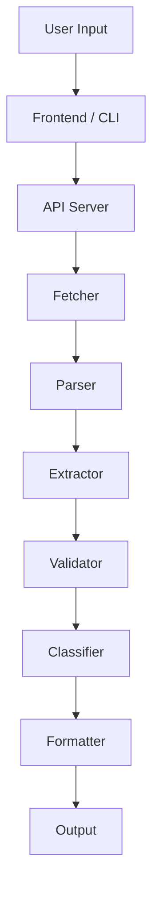
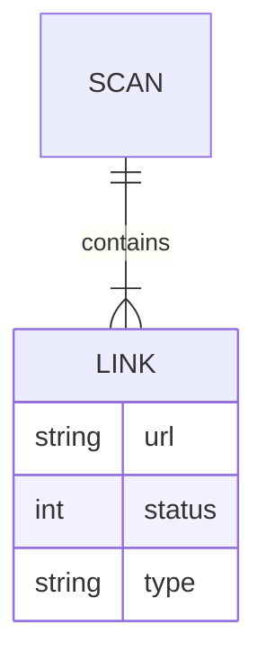

# Broken Link Checker

<p align="center">

<!-- Animated Gradient Banner -->

<svg width="100%" height="140" viewBox="0 0 900 140" xmlns="http://www.w3.org/2000/svg">
  <defs>
    <linearGradient id="grad">
      <stop offset="0%" stop-color="#0ea5e9">
        <animate attributeName="stop-color" values="#0ea5e9;#6366f1;#0ea5e9" dur="6s" repeatCount="indefinite"/>
      </stop>
      <stop offset="100%" stop-color="#6366f1">
        <animate attributeName="stop-color" values="#6366f1;#0ea5e9;#6366f1" dur="6s" repeatCount="indefinite"/>
      </stop>
    </linearGradient>
  </defs>

  <rect width="900" height="140" fill="#020617"/>

<text x="50%" y="45%" text-anchor="middle"
     font-size="34" fill="url(#grad)" font-family="monospace">
Broken Link Checker </text>

<text x="50%" y="75%" text-anchor="middle"
     font-size="14" fill="#94a3b8" font-family="monospace">
Scan • Detect • Analyze • Improve </text> </svg>

</p>

<p align="center">
  <b>Scan websites. Detect broken links. Improve reliability, UX, and SEO.</b>
</p>

---

## Badges

<p align="center">
  
  
  
  
  
  
</p>

---

## <!-- Simple Icon -->

<svg width="18" height="18" fill="currentColor"><circle cx="9" cy="9" r="8"/></svg> Project Overview

Broken Link Checker is a full-stack developer utility designed to scan websites, validate hyperlinks, and detect broken resources efficiently.

It provides both:

* Web Interface
* CLI Tool

---

## <svg width="18" height="18" fill="currentColor"><rect x="3" y="3" width="12" height="12"/></svg> Problem Statement

Websites often contain:

* Broken links
* Outdated references
* Invalid resources

These issues negatively impact:

* User experience
* SEO ranking
* System reliability

---

## <svg width="18" height="18" fill="currentColor"><polygon points="9,2 2,16 16,16"/></svg> Solution

This tool automates:

* Crawling pages
* Extracting links
* Validating resources
* Generating reports

---

## <svg width="18" height="18" fill="currentColor"><path d="M9 2L2 12h14L9 2z"/></svg> Key Features

* Parallel request handling
* Retry mechanism
* Multi-page crawling
* Broken image detection
* CLI + Web interface
* JSON export
* Filtering options

---

## <svg width="18" height="18" fill="currentColor"><circle cx="9" cy="9" r="8"/></svg> Tech Stack

<p align="center">
  
  
  
  
  
</p>

---

## <svg width="18" height="18" fill="currentColor"><rect x="2" y="2" width="14" height="14"/></svg> Installation

```bash id="ndq0qv"
git clone https://github.com/your-username/broken-link-checker.git
cd broken-link-checker
npm install
```

---

## <svg width="18" height="18" fill="currentColor"><polygon points="5,3 15,9 5,15"/></svg> Run Application

```bash id="p9nk7f"
node index.js
```

---

## <svg width="18" height="18" fill="currentColor"><rect x="3" y="3" width="14" height="14"/></svg> CLI Usage

```bash id="bw8j6o"
blc --url https://example.com
```

---

## <svg width="18" height="18" fill="currentColor"><circle cx="9" cy="9" r="8"/></svg> API

```json id="2wd3z7"
POST /scan
{
  "url": "https://example.com"
}
```

---

## <svg width="18" height="18" fill="currentColor"><rect x="3" y="3" width="14" height="14"/></svg> Project Structure

```text id="owb4vp"
broken-link-checker/
├── bin/
├── src/
├── public/
├── index.js
├── package.json
```

---

## <svg width="18" height="18" fill="currentColor"><circle cx="9" cy="9" r="8"/></svg> System Architecture



---

## <svg width="18" height="18" fill="currentColor"><circle cx="9" cy="9" r="8"/></svg> ER Diagram



---

## <svg width="18" height="18" fill="currentColor"><rect x="3" y="3" width="14" height="14"/></svg> Performance & Safety

* Rate limiting
* Timeout handling
* Retry logic
* Max link threshold

---

## <svg width="18" height="18" fill="currentColor"><polygon points="9,2 2,16 16,16"/></svg> Future Enhancements

* PDF reports
* Chrome extension
* AI-based analysis
* CI/CD integration

---

## <svg width="18" height="18" fill="currentColor"><rect x="2" y="2" width="14" height="14"/></svg> License

MIT © 2026 Chhatrapati Sahu

---

<p align="center">
  Built for modern web reliability and performance
</p>
