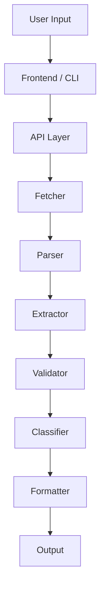
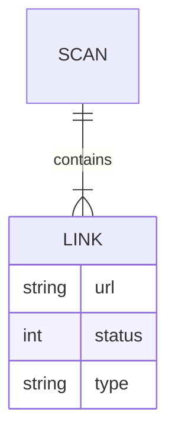

# Broken Link Checker

<p align="center">

<!-- 🔥 Custom Gradient Animated Banner -->

<svg width="100%" height="140" viewBox="0 0 800 140" xmlns="http://www.w3.org/2000/svg">
  <defs>
    <linearGradient id="grad" x1="0%" y1="0%" x2="100%">
      <stop offset="0%" stop-color="#0ea5e9">
        <animate attributeName="stop-color" values="#0ea5e9;#6366f1;#0ea5e9" dur="6s" repeatCount="indefinite"/>
      </stop>
      <stop offset="100%" stop-color="#6366f1">
        <animate attributeName="stop-color" values="#6366f1;#0ea5e9;#6366f1" dur="6s" repeatCount="indefinite"/>
      </stop>
    </linearGradient>
  </defs>

  <rect width="800" height="140" fill="#020617"/>

<text x="50%" y="45%" text-anchor="middle"
     font-size="30" fill="url(#grad)" font-family="monospace">
Broken Link Checker </text>

<text x="50%" y="75%" text-anchor="middle"
     font-size="14" fill="#94a3b8" font-family="monospace">
Scan • Detect • Fix </text> </svg>

</p>

<p align="center">
  <b>Scan websites. Detect broken links. Improve reliability, UX, and SEO.</b>
</p>

---

## <svg width="18" height="18" stroke="currentColor" fill="none" stroke-width="2"><circle cx="12" cy="12" r="10"/><line x1="12" y1="16" x2="12" y2="12"/><line x1="12" y1="8" x2="12.01" y2="8"/></svg> About the Project

Broken Link Checker is a full-stack developer utility that scans websites and validates all hyperlinks and media resources.

It identifies:

* Broken links (HTTP 4xx / 5xx)
* Redirect chains (3xx)
* Working links (2xx)
* Broken images

---

## <svg width="18" height="18" stroke="currentColor" fill="none" stroke-width="2"><circle cx="12" cy="12" r="10"/><path d="M9 12l2 2 4-4"/></svg> Problem Statement

Modern websites suffer from:

* Dead links
* Outdated resources
* Broken media

Leading to poor UX and SEO impact.

---

## <svg width="18" height="18" stroke="currentColor" fill="none" stroke-width="2"><path d="M12 2v20M2 12h20"/></svg> Solution

This tool automates:

* Crawling
* Link extraction
* Validation
* Reporting

---

## <svg width="18" height="18" stroke="currentColor" fill="none" stroke-width="2"><polygon points="13 2 3 14 12 14 11 22 21 10 12 10 13 2"/></svg> Key Features

* Parallel HTTP validation
* Retry mechanism
* Multi-page crawling
* Image validation
* CLI + Web interface
* JSON export

---

## <svg width="18" height="18" stroke="currentColor" fill="none" stroke-width="2"><rect x="3" y="3" width="7" height="7"/><rect x="14" y="3" width="7" height="7"/><rect x="14" y="14" width="7" height="7"/><rect x="3" y="14" width="7" height="7"/></svg> Tech Stack

* Node.js
* Express.js
* Axios
* Cheerio
* Vanilla JS

---

## <svg width="18" height="18" stroke="currentColor" fill="none" stroke-width="2"><path d="M4 4h16v16H4z"/></svg> Installation

```bash
git clone https://github.com/your-username/broken-link-checker.git
cd broken-link-checker
npm install
```

---

## <svg width="18" height="18" stroke="currentColor" fill="none" stroke-width="2"><polygon points="5,3 19,12 5,21"/></svg> Run

```bash
node index.js
```

---

## <svg width="18" height="18" stroke="currentColor" fill="none" stroke-width="2"><path d="M3 12h18"/></svg> CLI Usage

```bash
blc --url https://example.com
```

---

## <svg width="18" height="18" stroke="currentColor" fill="none" stroke-width="2"><path d="M12 2v20M2 12h20"/></svg> API

```json
POST /scan
{
  "url": "https://example.com"
}
```

---

## <svg width="18" height="18" stroke="currentColor" fill="none" stroke-width="2"><path d="M3 3h18v18H3z"/></svg> Advanced System Architecture



---

## <svg width="18" height="18" stroke="currentColor" fill="none" stroke-width="2"><circle cx="12" cy="12" r="10"/></svg> ER Diagram



---

## <svg width="18" height="18" stroke="currentColor" fill="none" stroke-width="2"><path d="M5 12h14"/></svg> Performance & Safety

* Rate limiting
* Timeout control
* Retry mechanism
* Max link threshold

---

## <svg width="18" height="18" stroke="currentColor" fill="none" stroke-width="2"><path d="M12 2l3 7h7l-5 5 2 7-7-4-7 4 2-7-5-5h7z"/></svg> Future Improvements

* PDF reports
* Chrome extension
* AI link analysis
* CI/CD integration

---

## <svg width="18" height="18" stroke="currentColor" fill="none" stroke-width="2"><path d="M3 3h18v18H3z"/></svg> License

MIT © 2026 Chhatrapati Sahu

---

<p align="center">
  Built for modern web reliability
</p>
