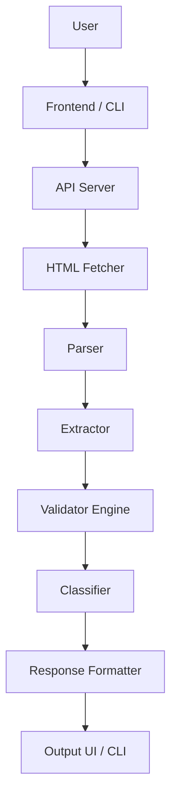
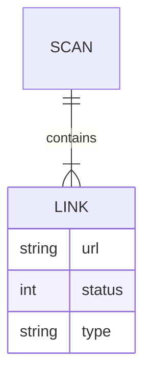

# Broken Link Checker

<p align="center">

<!-- Animated Gradient Banner -->

<svg width="100%" height="140" viewBox="0 0 900 140" xmlns="http://www.w3.org/2000/svg">
  <defs>
    <linearGradient id="grad">
      <stop offset="0%" stop-color="#0ea5e9">
        <animate attributeName="stop-color" values="#0ea5e9;#6366f1;#0ea5e9" dur="6s" repeatCount="indefinite"/>
      </stop>
      <stop offset="100%" stop-color="#6366f1">
        <animate attributeName="stop-color" values="#6366f1;#0ea5e9;#6366f1" dur="6s" repeatCount="indefinite"/>
      </stop>
    </linearGradient>
  </defs>

  <rect width="900" height="140" fill="#020617"/>

<text x="50%" y="45%" text-anchor="middle"
     font-size="34" fill="url(#grad)" font-family="monospace">
Broken Link Checker </text>

<text x="50%" y="75%" text-anchor="middle"
     font-size="14" fill="#94a3b8" font-family="monospace">
Scan • Detect • Analyze • Improve </text> </svg>

</p>

<p align="center">
  
</p>

---

## <svg width="18" height="18" stroke="currentColor" fill="none" stroke-width="2"><circle cx="12" cy="12" r="10"/></svg> Project Overview

Broken Link Checker is a full-stack developer utility designed to scan websites, validate hyperlinks, and detect broken resources in real-time.

The system performs automated crawling, extraction, and classification of links to provide actionable insights.

---

## <svg width="18" height="18" stroke="currentColor" fill="none" stroke-width="2"><path d="M12 2v20M2 12h20"/></svg> Problem Statement

Web applications frequently suffer from:

* Dead links (HTTP 404)
* Broken media assets
* Unmaintained external references
* SEO penalties due to crawl errors

Manual validation is inefficient and error-prone.

---

## <svg width="18" height="18" stroke="currentColor" fill="none" stroke-width="2"><polygon points="13 2 3 14 12 14 11 22 21 10 12 10 13 2"/></svg> Solution Approach

This tool automates:

* Website crawling
* Link extraction
* HTTP validation
* Error classification
* Report generation

Result: Faster debugging and improved site reliability.

---

## <svg width="18" height="18" stroke="currentColor" fill="none" stroke-width="2"><rect x="3" y="3" width="7" height="7"/><rect x="14" y="3" width="7" height="7"/></svg> Core Features

* Parallel request processing
* Retry mechanism for failures
* Multi-page crawling support
* Broken image detection
* CLI and Web interface
* JSON export support
* Internal and external filtering
* Response time tracking

---

## <svg width="18" height="18" stroke="currentColor" fill="none" stroke-width="2"><path d="M4 4h16v16H4z"/></svg> Tech Stack

### Backend

* Node.js
* Express.js
* Axios
* Cheerio

### Frontend

* HTML
* CSS
* Vanilla JavaScript

### CLI

* Commander.js
* Chalk

---

## <svg width="18" height="18" stroke="currentColor" fill="none" stroke-width="2"><polygon points="5,3 19,12 5,21"/></svg> Installation

```bash id="n8v0cj"
git clone https://github.com/your-username/broken-link-checker.git
cd broken-link-checker
npm install
```

---

## <svg width="18" height="18" stroke="currentColor" fill="none" stroke-width="2"><path d="M3 12h18"/></svg> Running the Application

```bash id="x4g8hb"
node index.js
```

Access the application at:

```
http://localhost:5000
```

---

## <svg width="18" height="18" stroke="currentColor" fill="none" stroke-width="2"><path d="M3 3h18v18H3z"/></svg> CLI Usage

```bash id="r7y1vc"
blc --url https://example.com
```

### Available Options

```
-u, --url <url>       Target URL
--internal            Scan only internal links
--external            Scan only external links
--json                Output JSON format
--summary             Display summary only
--deep                Enable deep crawling
```

---

## <svg width="18" height="18" stroke="currentColor" fill="none" stroke-width="2"><circle cx="12" cy="12" r="10"/></svg> API Interface

### Endpoint

```
POST /scan
```

### Request

```json id="fmbi0p"
{
  "url": "https://example.com",
  "deepScan": true
}
```

### Response

```json id="v9yqgo"
{
  "total": 25,
  "working": 18,
  "broken": 5,
  "redirect": 2
}
```

---

## <svg width="18" height="18" stroke="currentColor" fill="none" stroke-width="2"><path d="M4 4h16v16H4z"/></svg> Project Structure

```text id="2vyj6v"
broken-link-checker/
├── bin/
├── src/
│   ├── crawler.js
│   ├── utils.js
│   ├── formatter.js
├── public/
├── index.js
├── package.json
```

---

## <svg width="18" height="18" stroke="currentColor" fill="none" stroke-width="2"><path d="M3 3h18v18H3z"/></svg> System Architecture



---

## <svg width="18" height="18" stroke="currentColor" fill="none" stroke-width="2"><circle cx="12" cy="12" r="10"/></svg> ER Diagram



---

## <svg width="18" height="18" stroke="currentColor" fill="none" stroke-width="2"><path d="M5 12h14"/></svg> Performance Considerations

* Rate limiting implemented
* Maximum link threshold
* Timeout handling
* Retry mechanism
* Efficient batching

---

## <svg width="18" height="18" stroke="currentColor" fill="none" stroke-width="2"><polygon points="13 2 3 14 12 14 11 22 21 10 12 10 13 2"/></svg> Future Enhancements

* PDF / HTML reports
* Browser extension
* AI-based analysis
* CI/CD integration
* Visualization dashboard

---

## <svg width="18" height="18" stroke="currentColor" fill="none" stroke-width="2"><rect x="3" y="3" width="18" height="18"/></svg> License

MIT © 2026 Chhatrapati Sahu

---

<p align="center">
  Designed for modern web reliability and performance
</p>
