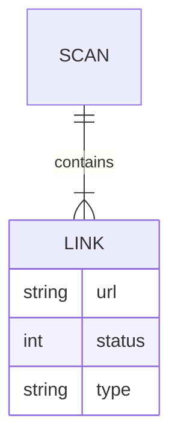

# Broken Link Checker

A full-stack tool to scan websites and detect broken links, redirects, and invalid resources to improve user experience and SEO.

---

## ✨ Features

* Scan websites for broken links
* Detect redirects and working links
* Support for internal and external link filtering
* Deep scan (multi-page crawling)
* CLI + Web interface
* JSON report output

---

## 🖥️ Tech Stack

**Backend**

* Node.js
* Express.js
* Axios
* Cheerio

**Frontend**

* HTML
* CSS
* JavaScript

**CLI**

* Commander.js
* Chalk

---

## 🛠️ Setup & Usage

### 1. Clone the repository

```bash
git clone https://github.com/your-username/broken-link-checker.git
cd broken-link-checker
```

### 2. Install dependencies

```bash
npm install
```

### 3. Run the application

```bash
node index.js
```

### 4. Open in browser

```
http://localhost:5000
```

---

## 📦 API Example

### POST `/scan`

#### Request

```json
{
  "url": "https://example.com",
  "onlyInternal": false,
  "onlyExternal": false,
  "deepScan": false
}
```

#### Response

```json
{
  "total": 10,
  "working": 7,
  "broken": 2,
  "redirect": 1,
  "results": [
    {
      "url": "https://example.com/about",
      "status": 200,
      "type": "WORKING"
    }
  ]
}
```

---

## 🚀 CLI Usage

```bash
blc --url https://example.com
```

---

## 📁 Project Structure

```text
broken-link-checker/
├── bin/
├── src/
├── public/
├── index.js
└── package.json
```

---

## 🧩 Architecture (ER Diagram)



---

## ⚡ Performance & Safety

* Rate limiting
* Timeout handling
* Retry mechanism
* Max link limit

---

## 📄 License

MIT

---

## 👤 Author

Chhatrapati Sahu
https://github.com/Chhatrapati-sahu-09
