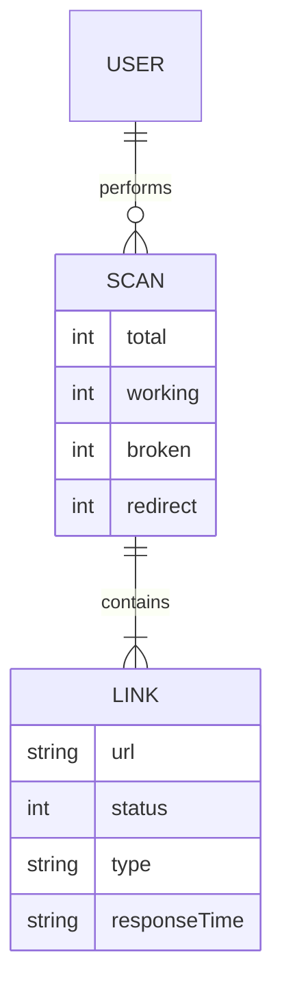

# Broken Link Checker

<p align="center">
  <a href="https://github.com/Chhatrapati-sahu-09">
    
  </a>
</p>

---

## 

<p align="center">
  
  
  
  
  
</p>

---

## Overview

Broken Link Checker is a developer-focused tool that scans websites and identifies:

<ul>
<li> Broken links (HTTP 4xx / 5xx)</li>
<li> Redirect links (3xx)</li>
<li> Working links (2xx)</li>
<li> Broken images</li>
</ul>

Available as:

<ul>
<li> Web Application</li>
<li> CLI Tool</li>
</ul>

---

## Features

| Icon                                                                      | Feature         | Description         |
| ------------------------------------------------------------------------- | --------------- | ------------------- |
|     | Link Scanning   | Extract all links   |
|  | Fast Checking   | Parallel processing |
|      | Deep Scan       | Multi-page crawl    |
|      | Image Detection | Broken images       |
|      | Analytics       | Stats dashboard     |
|     | Filtering       | Internal/external   |
|   | Export          | JSON report         |
|   | CLI Tool        | Terminal usage      |

---

## CLI Usage

```bash
blc --url https://example.com
```

---

## Installation

```bash
git clone https://github.com/your-username/broken-link-checker.git
cd broken-link-checker
npm install
```

---

## Run Application

```bash
node index.js
```

---

## Project Structure

```text
broken-link-checker/
├── bin/
├── src/
├── public/
├── index.js
└── package.json
```

---

## Architecture (ER Diagram)



---

## Performance & Safety

<ul>
<li> Rate limiting</li>
<li> Timeout handling</li>
<li> Retry mechanism</li>
<li> Max link limit</li>
</ul>

---

## GitHub Analytics

<p align="center">
  
</p>

<p align="center">
  
</p>

<p align="center">
  
</p>

---

## License

MIT © 2026 Chhatrapati Sahu

---

<p align="center">
  Built for developers focused on performance and reliability
</p>
